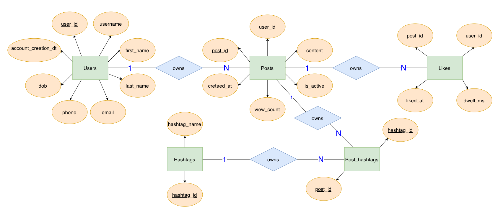

# **Course: EX603 - Data & Algorithms for Scalable Systems**
**Name: Aamnah Malik**
**Database Theme: Social Media**

## Introduction
This repository will be used to store all work towards designing and building a relational database for a text-based social media platform, with an underlying structure of users, posts, likes, hashtags, post_hashtags, and a key metric of dwell_ms.

## Domain
The system I'm designing will be a text-based social media platform. Users can create as many accounts as they'd like, as long as they have unique usernames. They can create as many posts as they want to from each account, each of which will be given its own automated post_id when created. Posts can be marked as active or inactive, and their view count will be stored. Within its text content, a post can have any number of hashtags. Each post can have any number of likes, but each user can only like an individual post once. The hashtags are stored in their own table - each text string can only be created as a hashtag once, and will be assigned its own id. The associations between posts and hashtags are stored in the junction table 'post_hashtags'. 

This system is meant to be able to answer various questions about users, their performance, and their engagement. With the various metrics included across the relations, it should be able to look at how hashtags, view count, and viewing time affect the performance of a post. The system should also be able to determine which hashtags are associated with more popular posts, and which users themselves are performing at a higher rate than others. The various timestamp fields will also allow the system to look at how metrics are changing over time for different users and hashtags. All of these are valuable measures in the social media world especially for people looking to maximize their engagement.

# Entity Relationship Diagram
